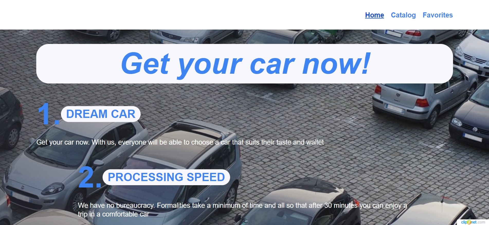
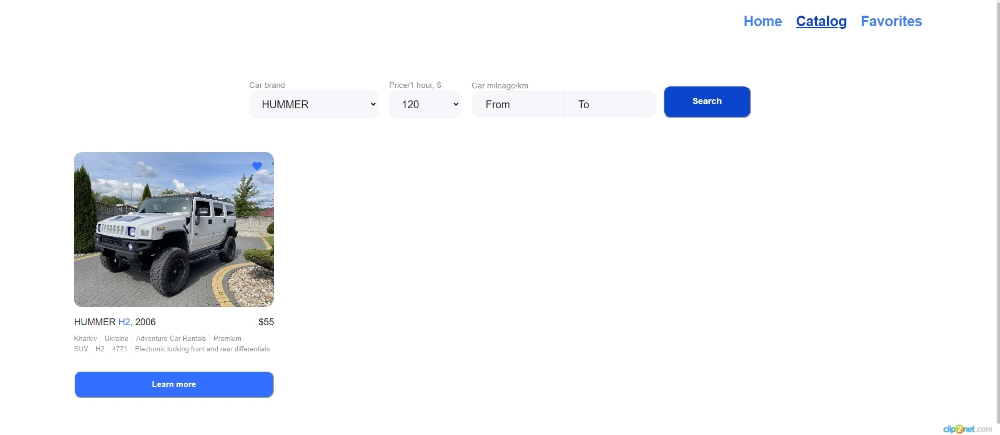

# Get your car now!

This site was created to quickly and safely search for cars provided in rent.

## Home page

During the first entering to the site, the user sees the main page of the site,
where is possible to get acquainted with the advantages of renting cars in our
company.

At the bottom of the main page, the user can familiarize himself with the list
of available for rental car brands.

## Catalog of cars

The car catalog page provides the user with an expanded option form to get
information about cars available for rent with a convenient batch loading
(pagination).

### Data filtering by cars

Data filtering options are available:

- **car brands**;
- **rental cost (for 1 hour)**;
- **total vehicle mileage in kilometers (from and to)**.

### Detailed information on the car and rental conditions

By pressing the button `Learn more` a modal window opens with a full information
about the car and its rental conditions

### Add to favorites

Click on the icon `heart` will add the car to the favorites catalog cars on the
page `Favorites`.

## Selected cars page

The entire list of selected cars is displayed. The same actions are available as
on page `Catalog`: filtering, viewing detailed information on the car,
pagination.

## Technologies Used

#### React:

React is a JavaScript library for building user interfaces, enabling you to
create dynamic and highly performant web applications. Your application is built
on React, making it easy to create components and manage application state.

#### Redux Toolkit:

Redux Toolkit is a library for managing the state of your application in React
projects. It helps organize and simplify state management, centralizing it and
providing debugging tools.

#### Axios:

Axios is a library for making HTTP requests in your React applications, allowing
you to interact with the server, fetch, and send data.

#### React Router DOM:

React Router DOM is a library for navigation and routing in React applications,
enabling the creation of routers and page navigation.

#### Yup:

Yup is a library for data validation in React applications, allowing you to set
validation rules for forms and data, ensuring their correctness.

#### React-Redux:

React-Redux is a library for integrating Redux into your React applications,
simplifying the connection between Redux state and React components.

#### Formik:

Formik is a library for managing forms in React applications, making form
creation and management more convenient and efficient.

#### Swiper:

Swiper - is the free and most modern mobile touch slider with hardware
accelerated transitions and amazing native behavior.

#### Styled-components:

Styled-components - is a library for writing CSS styles in JavaScrict code
directly.
