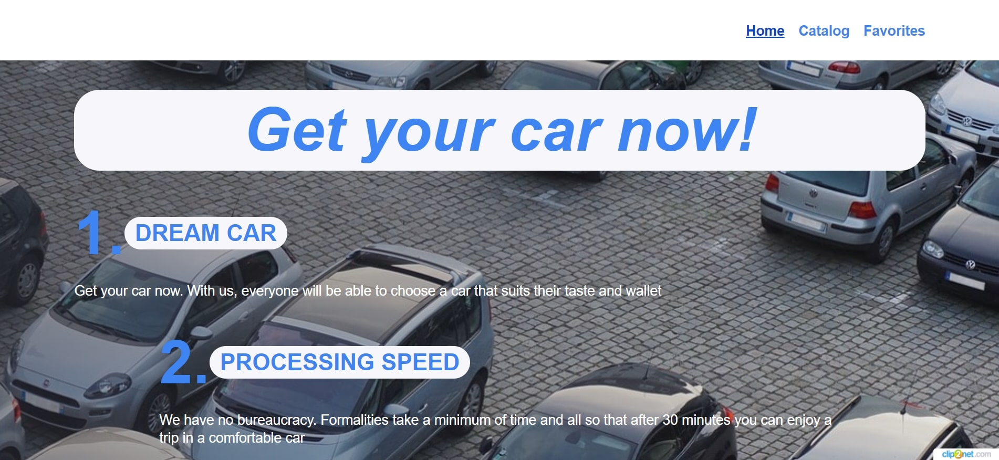
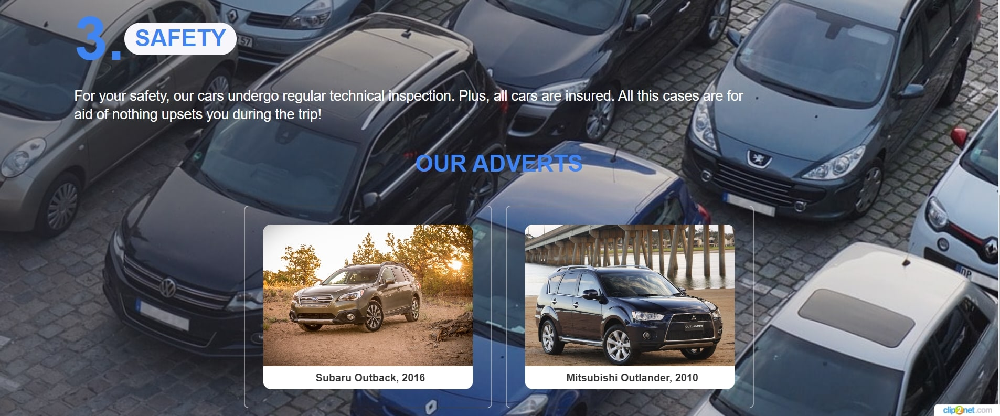
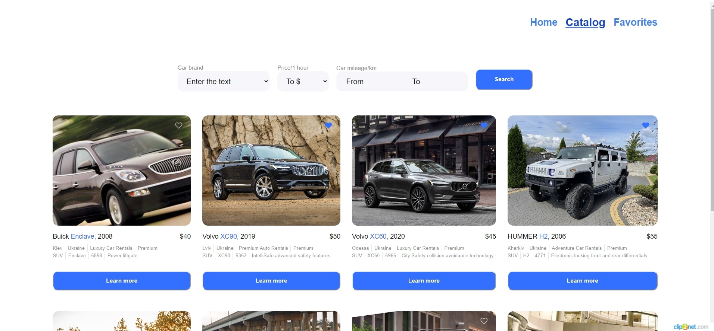
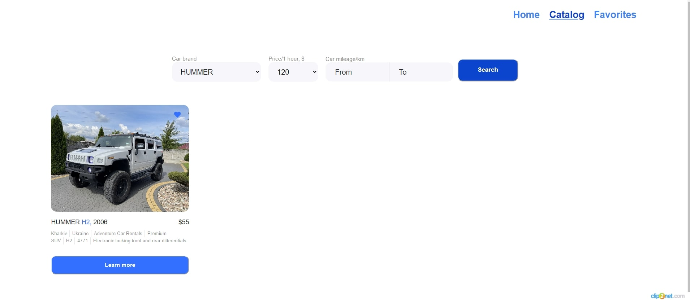
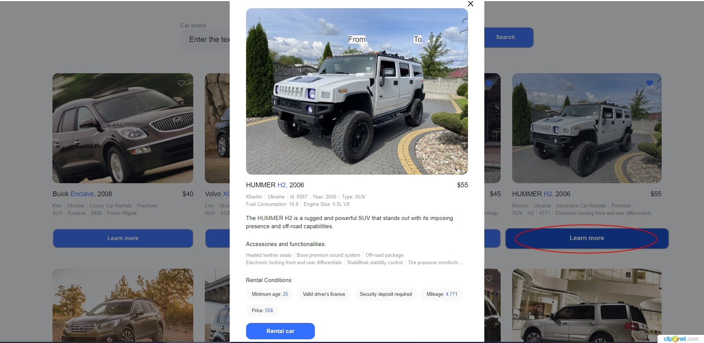
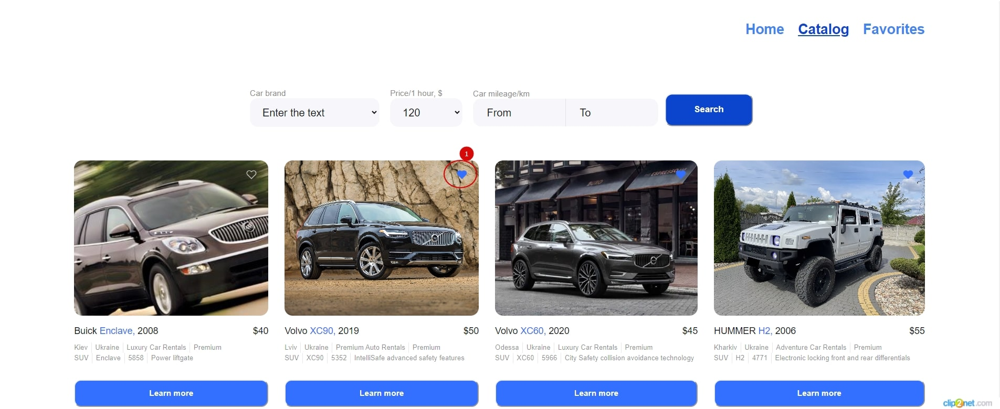
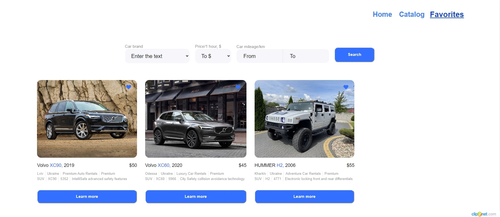

**Read in other languages: [english](README.en.md)**

# Get your car now!

Цей сайт створено для швидкого та безпечного пошуку автомобілів, що надаються в
оренду.

## Головна сторінка

Під час першого входу на сайт користувач бачить головну сторінку сайту, де можна
ознайомитись із перевагами оренди автомобілів саме в нашій компанії.

Внизу головної сторінки користувач може ознайомитися з переліком доступних для
оренди марок автомобілів.

## Каталог автомобілів

Сторінка з каталогом автомобілів надає можливість користувачу в розгорнутому
вигляді отримати інформацію про доступні для оренди автомобілі із зручним
порційним завантаженням (пагінацією).

### Фільтрація даних по автомобілях

Доступні варіанти фільтрування даних за:

- **маркою автомобіля**;
- **вартістю оренди (за 1 годину)**;
- **загальним пробігом автомобіля в кіломентах (від та до)**.

### Детальна інформація по автомобілю та умовах оренди

По натисненю на кнопку `Learn more` відкривається модальне вікно з повною
інформацією про автомобіль та умови його оренди

### Додавання у вибране

Натиснення на іконку `сердечка` додасть автомобіль в каталог обраних автомобілів
на сторінці `Favorites`.

## Сторінка обраних автомобілів

Відображається весь перелік обраних автомобілів. Доступні ті ж самі дії, що і на
сторінці `Catalog`: фільтрація, перегляд детальної інфорації по автомобілю,
пагінація.

## Використані технології

#### React:

React - це JavaScript-бібліотека для створення користувацьких інтерфейсів, що
дозволяє створювати динамічні та високопродуктивні веб-додатки. GooseTracks
базується на React, що спрощує створення компонентів та управління станом
додатку.

#### Redux Toolkit:

Redux Toolkit - це бібліотека для управління станом вашого додатку в проектах
React. Вона допомагає організувати та спростити управління станом, централізуючи
його та надаючи інструменти для відлагодження.

#### Axios:

Axios - це бібліотека для виконання HTTP-запитів у ваших додатках React, яка
дозволяє спілкуватися з сервером, отримувати та надсилати дані.

#### React Router DOM:

React Router DOM - це бібліотека для навігації та маршрутизації в додатках
React, яка дозволяє створювати маршрути та навігацію між сторінками.

#### Yup:

Yup - це бібліотека для валідації даних в додатках React, яка дозволяє
встановлювати правила валідації для форм та даних, забезпечуючи їхню
коректність.

#### React-Redux:

React-Redux - це бібліотека для інтеграції Redux у ваші додатки React, спрощуючи
зв'язок між станом Redux та компонентами React.

#### Swiper:

Swiper - це безкоштовний і найсучасніший мобільний сенсорний слайдер з апаратним
прискоренням переходів і дивовижною нативною поведінкою.

#### Styled-components:

Styled-components — це бібліотека для написання стилів CSS у коді JavaScrict.
